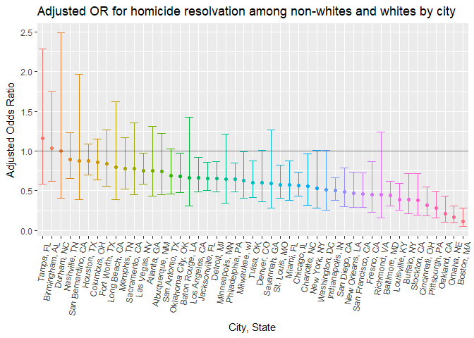

p8105\_hw6\_xs2330
================
Xiao Shi
November 15, 2018

Problem 1
---------

Using tidyverse library for data cleaning and analysis, leaps for stepwise selection, and the rest for cross validation

**Data cleaning and tidying**

``` r
raw_homicide = read_csv("./homicide-data.csv") 
homicide = raw_homicide %>%
  mutate(city_state = str_c(city, state, sep = ", ")) %>%
  mutate(case_status = recode(disposition, "Closed without arrest" = "unsolved", 
                      "Open/No arrest" = "unsolved",
                      "Closed by arrest" = "solved")) %>%
  filter(city_state != "Dallas, TX" & city_state != "Phoenix, AZ" & city_state != "Kansas City, MO" & city_state != "Tulsa, AL") %>%
  mutate(race_general = ifelse(victim_race == "White", "white","non_white"),
         victim_age = as.numeric(victim_age),
         race_general = fct_relevel(as.factor(race_general),"white")) %>%
  janitor::clean_names()
```

Upon removing cities that do not have information that we need, and mutate variables such as `victim_age` and `victim_race`, the resulting dataset consists 48507 rows by 15 columns.

**Fitting model for Baltimore, MD**

This is a logistic regression with resolved vs unresolved as the outcome and `victim_age`, `victim_sex` and `race_general` (as just defined) as predictors.

``` r
balti_homicide = homicide %>%
  filter(city_state == "Baltimore, MD") %>%
  mutate(case_status = ifelse(case_status == "solved",1,0))

glm_case_status = glm(case_status ~ victim_age + victim_sex + race_general, data = balti_homicide, family = binomial())
output_glm_case_status = summary(glm_case_status)
save(output_glm_case_status,file = "./homicide_balti.rdata")
```

Tidy the results and compare the adjusted odds ratio for solving homicides comparing white victims to non-white victims keeping all other variables fixed in Baltimore, MD.

``` r
glm_case_status %>% 
  broom::tidy() %>% 
  mutate(OR = exp(estimate),
         OR_lower = exp(estimate - std.error * 1.96),
         OR_upper = exp(estimate + std.error * 1.96)) %>%
  select(term, OR, OR_lower, OR_upper, p.value) %>% 
  knitr::kable(digits = 3)
```

| term                    |     OR|  OR\_lower|  OR\_upper|  p.value|
|:------------------------|------:|----------:|----------:|--------:|
| (Intercept)             |  3.274|      2.067|      5.186|    0.000|
| victim\_age             |  0.993|      0.987|      0.999|    0.032|
| victim\_sexMale         |  0.412|      0.315|      0.537|    0.000|
| race\_generalnon\_white |  0.441|      0.313|      0.620|    0.000|

From the above table, we see that homicide cases among non-whites are much less likely to be solved compared to cases among white people. The adjusted odds ratio is 0.441 with a p-value of 0.0000027, indicating statistically significant difference at a 95% confidence level.

**Run through the same process for all cities**

First we build a function that give results to a `city_state`

``` r
white_nonwhite_solved = function(city_input){
city_homicide = homicide %>%
  filter(city_state == city_input) %>%
  mutate(case_status = ifelse(case_status == "solved",1,0))

glm_case_status = glm(case_status ~ victim_age + victim_sex + race_general, data = city_homicide, family = binomial()) %>%
  broom::tidy() %>% 
  filter(term == "race_generalnon_white") %>%
  mutate(OR = exp(estimate),
         OR_lower = exp(estimate - std.error * 1.96),
         OR_upper = exp(estimate + std.error * 1.96)) %>%
  select(term, OR, OR_lower, OR_upper, p.value) %>% 
  print(knitr::kable(glm_case_status))
}
```

Next we loop every city\_state using the map function

``` r
output_allcities = purrr::map_df(.x = unique(homicide$city_state), white_nonwhite_solved) %>%
  mutate(term = str_c("non-white", unique(homicide$city_state), sep = " in ")) %>%
  select(term, OR, OR_lower, OR_upper) %>%
  print(knitr::kable(output_allcities))
```

To better show the results we see from the above resulting table where homicide cases among non-whites are much less likely to be solved compared to cases among white people in all the cities, we plot a graph below. The graph consists estimated adjusted odds ratios and its range in a decreasing order.

**Create a plot showing the above case solving results**

``` r
output_allcities$city = unique(homicide$city_state)
ggplot(data = output_allcities, mapping = aes(x = reorder(city, -OR), y = OR, color = reorder(city, -OR))) +
  geom_point() +
  geom_errorbar(aes(ymin = OR_lower, ymax = OR_upper)) +
  geom_hline(yintercept = 1, alpha = 0.5) +
  theme(legend.position = "none", 
        axis.text.x = element_text(angle = 80, hjust = 1)) +
  labs(
    title = "Adjusted OR for homicide resolvation among non-whites and whites by city",
    x = "City, State",
    y = "Adjusted Odds Ratio"
  )
```



From the graph, we see that 43/47 cities except `Tampa, FL`, `Birmingham, AL`, `Durham, NC` showed a higher aOR estimation of homicide solving rate in white victim comparing to non-whites. Whatsmore, although we don't the similar trend in the three cities mentioned above, these three have a larger confidence interval. This indicates a higher possibility of less precise estimation. The graph is in a descending order based on the estimation of aOR.
